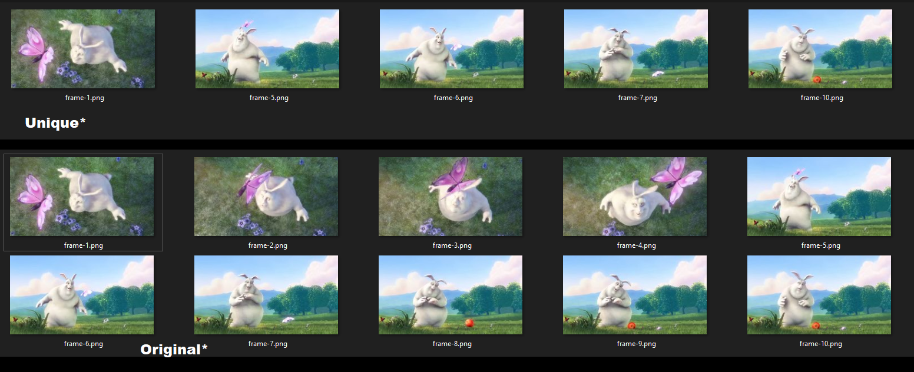

# Video Frame Extractor With Frame Comparison (V-FEC)

A Node.js Command Line Interface (CLI) tool for extract videos frames and compare them.

## Installation

```bash
npm install
```

## Usage

```bash
node src/presentation/cli.js --input <input_file> [--outputPath <output_directory>] [--threshold <threshold>] [--ffmpegParameters <ffmpeg_parameters>]
```

## Options

- `--input` - Input video file path.
- `--outputPath` - Output directory path. Default: `./output`.
- `--threshold` - Threshold value for frame comparison. Default: `55`.
- `--ffmpegParameters` - FFMPEG parameters for frame extraction. Default: `-vf fps=1 -q:v 2`.

## Show Case


```bash
node src/presentation/cli.js --input mov_bbb.mp4
```




